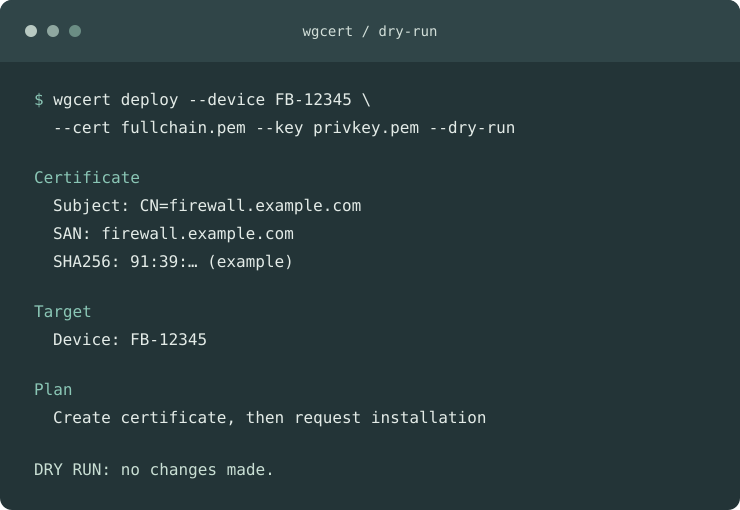

# WatchGuard ACME Deploy (`wgcert`)

[Project page](https://eliazv.github.io/watchguard-acme-deploy/) · [Step-by-step guide](https://eliazv.github.io/watchguard-acme-deploy/guide.html) · [v0.1.0 prerelease](https://github.com/eliazv/watchguard-acme-deploy/releases/tag/v0.1.0) · [Help test on a Firebox](https://github.com/eliazv/watchguard-acme-deploy/issues/new/choose)



Open-source Go CLI for deploying already-issued TLS certificates to **cloud-managed WatchGuard Firebox** devices through the official WatchGuard Firebox Management API.

> [!IMPORTANT]
> This project is in an early validation phase and has **not yet been tested end-to-end against a real Firebox**. Do not use it in production until the real-device validation checklist is complete.

## Quick Start

1. Download the [v0.1.0 prerelease](https://github.com/eliazv/watchguard-acme-deploy/releases/tag/v0.1.0) for your platform and check it against `SHA256SUMS`, or [build from source](#build-from-source).
2. Set the WatchGuard Cloud environment variables listed in [Configuration](#configuration).
3. Discover a device and run a mutation-free plan:

```sh
wgcert devices
wgcert deploy --device FB-12345 --cert fullchain.pem --key privkey.pem --dry-run
```

4. On a disposable cloud-managed Firebox, request installation and verify the intended service:

```sh
wgcert deploy --device FB-12345 --cert fullchain.pem --key privkey.pem
wgcert check --device FB-12345 --verify-host firewall.example.com:443
```

The install command is asynchronous. `--deploy-config --wait 2m` requests a full device configuration deployment and waits for its transaction; it may deploy **all pending changes** for that device. Review them first.

## Goal

Keep certificate issuance where it already belongs (Certbot, acme.sh, another ACME client or CA) and make WatchGuard deployment reliable and automatable.

CLI:

```bash
wgcert devices
wgcert deploy --device FB-12345 --cert fullchain.pem --key privkey.pem --dry-run
wgcert deploy --device FB-12345 --cert fullchain.pem --key privkey.pem
wgcert check --device FB-12345
```

The intended flow is:

```text
ACME client / CA
      |
      v
renewed certificate
      |
      v
    wgcert
      |
      v
WatchGuard Firebox Management API
      |
      v
cloud-managed Firebox
      |
      v
fingerprint / optional TLS verification
```

## Scope

Initial scope is intentionally small:

- discover Firebox devices available through the WatchGuard API;
- reject or clearly identify unsupported locally-managed devices;
- parse PEM certificates and private keys locally;
- calculate certificate fingerprints and metadata;
- upload/create certificates through the official API;
- install them on selected cloud-managed Fireboxes;
- make deployment idempotent where possible;
- verify the resulting certificate metadata;
- optionally verify the certificate served by a hostname with a TLS handshake;
- provide Certbot and acme.sh deploy-hook examples.

Out of scope for v0.1: dashboard, database, scheduler, user accounts, billing, certificate issuance, SaaS hosting, SSH/Expect automation, and support for other firewall vendors.

## Current limitation

WatchGuard's Certificate API works only with **cloud-managed Fireboxes** whose configuration is stored in WatchGuard Cloud. Locally-managed Fireboxes are not part of the v0.1 target.

## Validation status

Most of the project can be developed and tested without owning a Firebox by using unit tests, generated X.509 fixtures, HTTP mock servers, API contract fixtures and dry-run behavior.

A real cloud-managed Firebox or FireboxV evaluation is still required before calling the deployment flow production-tested. See [docs/testing.md](docs/testing.md).

## Documentation

- [Research and opportunity validation](docs/research.md)
- [Testing without WatchGuard hardware](docs/testing.md)
- [v0.1 MVP specification](docs/mvp.md)

## Build from source

Requires Go 1.22 or later. From the repository root:

```sh
go test ./...
go build -o wgcert ./cmd/wgcert
```

## Configuration

Set these environment variables with the values from WatchGuard Cloud **Administration > Managed Access**:

```text
WATCHGUARD_ACCOUNT_ID
WATCHGUARD_API_URL             # regional base API URL, e.g. https://api.usa.cloud.watchguard.com
WATCHGUARD_AUTH_URL            # regional Authentication API URL, with or without /oauth/token
WATCHGUARD_API_KEY
WATCHGUARD_ACCESS_ID           # read-write ID for deploy
WATCHGUARD_ACCESS_PASSWORD
```

Use read-only credentials for `devices` and `check` if available. Avoid shell history and process arguments for secrets; the CLI reads them only from the environment. Keep hook files and environment configuration readable only by the service account.

## Deploy and inspect

```sh
wgcert devices --output json
wgcert deploy --device FB-12345 --cert fullchain.pem --key privkey.pem --dry-run
wgcert deploy --device FB-12345 --cert fullchain.pem --key privkey.pem --output json
wgcert check --device FB-12345 --output json
wgcert check --device FB-12345 --verify-host firewall.example.com:443
```

The generated certificate name includes a SHA-256 fingerprint prefix. Repeating a deploy reuses the matching remote certificate instead of uploading a duplicate. The install command may still be sent again because the certificate inventory does not prove which certificate is active. Do not use a fixed `--name` across renewals unless you manage name collisions yourself.

`install` is asynchronous. A successful CLI response means WatchGuard accepted the command, not that the Firebox is already serving the new certificate. To request a full configuration deployment, add `--deploy-config`; this deploys **all pending configuration changes for the device**, not just the certificate. Add `--wait 2m` to wait for that deployment transaction to complete. Use `--verify-host` to compare the actual TLS endpoint against the local certificate after the Firebox has applied the change. The intended service must already reference the installed certificate; renewal reference behavior still needs Firebox validation.

## ACME hooks

`hooks/certbot/deploy.sh` uses Certbot's `RENEWED_LINEAGE`. Set `WGCERT_DEVICE` and the WatchGuard variables in the hook environment, then install the executable hook in Certbot's deploy-hook directory. `hooks/acme.sh/reload.sh` is for acme.sh's `--install-cert` workflow: set `WGCERT_CERT` and `WGCERT_KEY` to the installed fullchain and key paths, and run the script through `--reloadcmd`. Both scripts call `wgcert deploy` only after ACME has produced files. Add `--deploy-config` only after reviewing the device's pending configuration changes.

## Validation level and feedback

**Level 2: mocked API.** Unit, CLI, TLS, and mock HTTP tests pass locally. Real WatchGuard Cloud credentials and a cloud-managed Firebox are needed for the next validation levels. See [the testing plan](docs/testing.md). If you can test on a real Firebox, please use the [Firebox test issue template](https://github.com/eliazv/watchguard-acme-deploy/issues/new/choose) and report the model, Fireware version, management mode, intended certificate use, and sanitized result. Never post private keys or API credentials. See [SECURITY.md](SECURITY.md) for private vulnerability reporting.

## Disclaimer

This is an unofficial community project. It is not affiliated with, endorsed by, or supported by WatchGuard Technologies.
